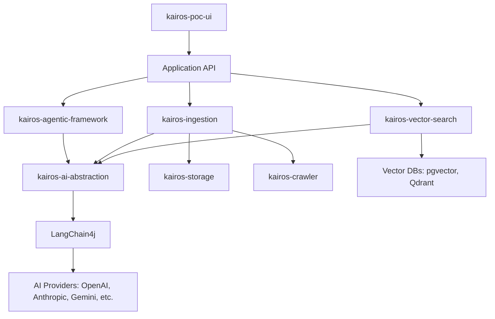

# KAIROS - Knowledge & Agentic Intelligence Runtime

KAIROS is a foundational platform designed for building intelligent, agentic applications with a focus on Retrieval-Augmented Generation (RAG) and automated knowledge ingestion. It provides a modular, extensible architecture that leverages the latest advancements in LLMs and vector search to create powerful AI-driven solutions.

## Overview

The KAIROS platform enables developers to:
- **Ingest** data from various sources (files, web, etc.) into a structured knowledge base.
- **Process** and enrich information using advanced AI models.
- **Store** and retrieve knowledge efficiently using hybrid vector search.
- **Build** agentic workflows that can interact with users and external systems.
- **Scale** applications with a Spring Boot-based microservices-ready architecture.

## Key Features

- **Advanced RAG Pipeline**: End-to-end support for Retrieval-Augmented Generation, including document parsing, splitting, embedding, and hybrid retrieval.
- **Agentic Framework**: A robust framework for creating AI agents with tool-calling capabilities, conversational forms, and transactional integrity.
- **Multi-Modal Support**: Process and analyze text, images, audio, and video using state-of-the-art AI models.
- **Hybrid Vector Search**: Support for both vector and keyword-based search using providers like PostgreSQL (pgvector) and Qdrant.
- **Extensible Integration**: Built on top of [LangChain4j](https://github.com/langchain4j/langchain4j), KAIROS supports all major AI providers including OpenAI, Anthropic, Google Gemini, and more.
- **Automated Web Crawling**: Integrated web crawler for automated data collection from the internet.
- **Spring Boot Ecosystem**: Seamless integration with Spring Boot via auto-configuration and custom starters.

## Architecture

KAIROS follows a modular architecture where each component is loosely coupled and highly configurable.

## Modules

The platform is divided into several core modules:

- **[kairos-core](./kairos-platform/kairos-core)**: Base interfaces and domain models.
- **[kairos-ai-abstraction](./kairos-platform/kairos-ai-abstraction)**: LLM and Embedding model adapters.
- **[kairos-ingestion](./kairos-platform/kairos-ingestion)**: Document processing and enrichment pipeline.
- **[kairos-vector-search](./kairos-platform/kairos-vector-search)**: Hybrid search and vector storage implementation.
- **[kairos-agentic-framework](./kairos-platform/kairos-agentic-framework)**: Agent and tool-calling infrastructure.
- **[kairos-crawler](./kairos-platform/kairos-crawler)**: Scalable web crawling service.
- **[kairos-storage](./kairos-platform/kairos-storage)**: Abstracted file storage (Local, GCS).
- **[kairos-autoconfigure](./kairos-platform/kairos-autoconfigure)**: Spring Boot auto-configuration.
- **[kairos-poc-ui](./kairos-poc-ui)**: React-based proof of concept frontend.

## Getting Started

To get started with KAIROS, you can explore the individual module documentation or check out the [kairos-platform](./kairos-platform) for backend build instructions.

### Prerequisites
- Java 17+
- Node.js & npm (for the UI)
- Maven 3.8+
- Docker (optional, for vector databases)

## License

KAIROS is licensed under the [Apache License, Version 2.0](http://www.apache.org/licenses/LICENSE-2.0).
